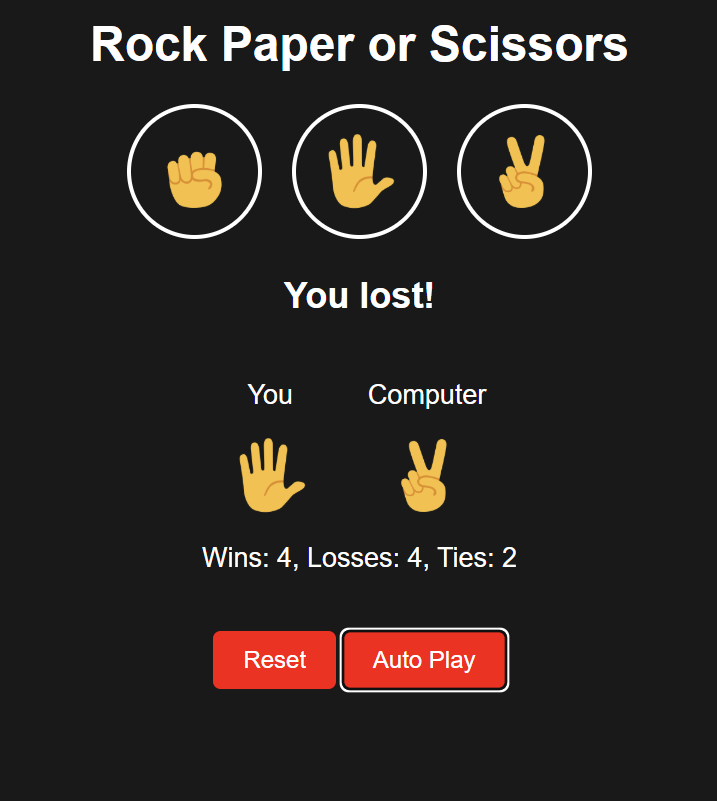
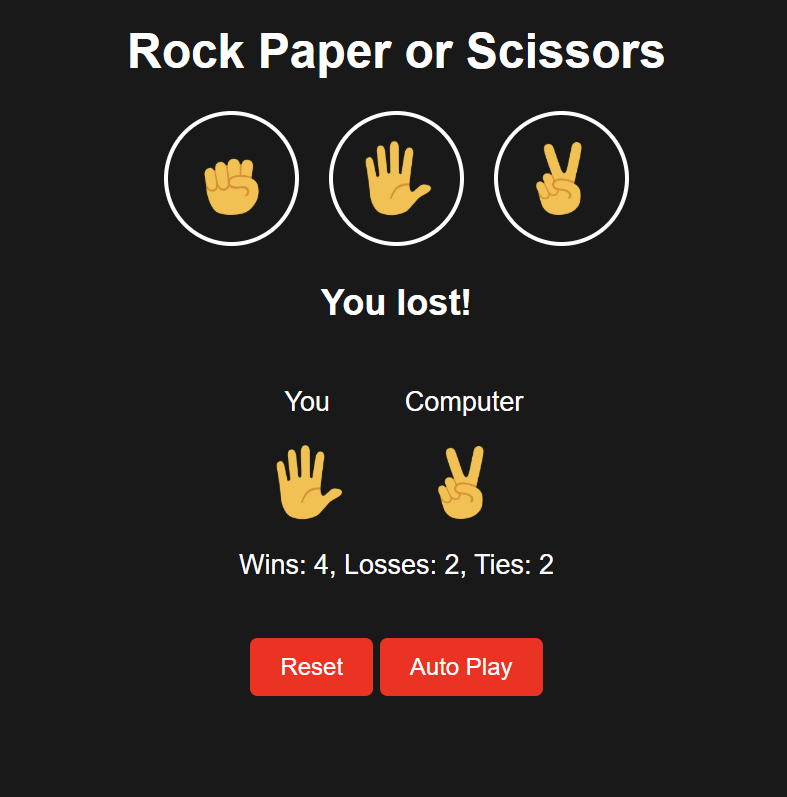

# 🪨 Rock Paper Scissors Game

A simple and fun Rock Paper Scissors game built using HTML, CSS, and JavaScript. Play against the computer in your browser!

## 🎮 Live Demo

 [Play Here](https://konczdaniel.github.io/rock-paper-scissors/) 

## 🔧 How It Works

  Player Input: The user selects Rock, Paper, or Scissors by clicking a button.
  
  Computer Choice: The computer uses Math.random() which gives every time a number betwen 0-1 and its interpreted like this:
  
| Random Number    | Computer Choice        |
|------------------|------------------------|
| <=0.33           | Rock                   |
| <=0.66           | Paper                  |
| >0.66 but <1     | Scissors               |

  
  Comparison: The player's and computer's choices are compared using standard game rules:
  
  Rock beats Scissors
  
  Scissors beats Paper
  
  Paper beats Rock
  
  Result Display: The game updates the DOM to show the result of the round and updates the score.

  Reset button resets the score.
  
 It also has a button that says Auto Play wich makes the game play by itself at an interval of 1 second,
 pressing it again makes it stop.

   

## ✨ Features
🎮 Interactive UI

🤖 Random computer choices

🧮 Score tracking

📱 Responsive design

## 🛠️ Tech Stack
HTML

CSS

JavaScript

## 📸 Screenshots

> 💡 Some Images of the program:
<table>
  <tr>
    <td></td>
    <td></td>
    <td></td>
  </tr>
  <tr>
    <td></td>
    <td></td>
    <td></td>
  </tr>
</table>
